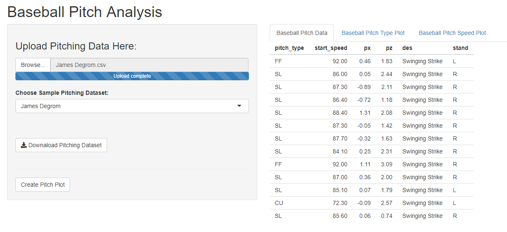
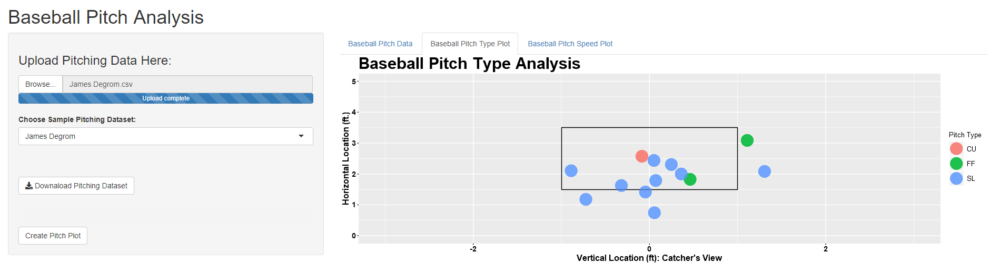
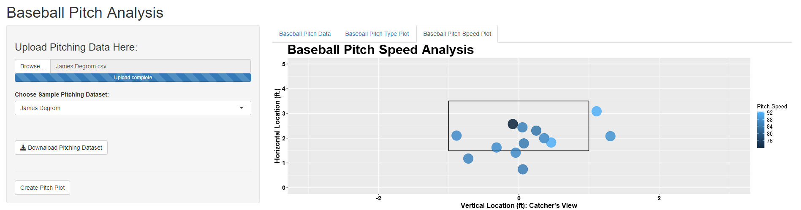

This application allows the user to compare the pitches of an individual baseball pitcher. The pitches are visualized utilizing a ggplot2 plot and color coded with one plot for speed and the other plot for type of pitch. This allows users to determine where and when what pitches were thrown. 

### Pitch Data

---

### Pitch Type

+ The pitch type plot allows an user to visualize the type of pitches that are thrown. The rectangle is the catcher's view and is where an umpire may call a strike or a ball. 

---

---

### Pitch Speed

+ The pitch speed plot allows an user to visualize the speed of each pitch. The rectangle is the catcher's view and is where an umpire may call a strike or a ball. 

### Pitching Datasets

+ The pitching datasets that can be selected are for the following Pitchers: James Degrom, Clayton Kershaw, and Matt Shoemaker. The user can select the pitcher they want to see a sample plot of or can upload their own data as well. 

+ The pitching data consist of the following in the .csv file. 

|pitch_type| start_speed|px|pz|des|stand|
|:---:|:---:|:---:|:---:|:---:|:----:|
|  FF | 92  | 0.461  |1.826   |Swinging Strike   |  L  | 
| SL|86|0.051|2.438|Swinging Strike|R|
|SL|87.3|-0.889|2.106|Swinging Strike|R|

---

